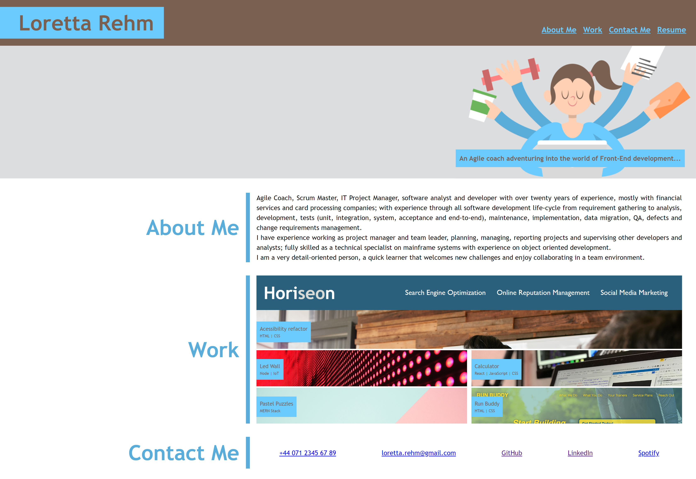

# Portfolio
Repository for my Web Development Portfolio

&nbsp;&nbsp;&nbsp;

---
## Installation

No installation is required.
Click [here](https://lorettarehm.github.io/lr_portfolio/) to access the page.

## Usage 
The portfolio webpage includes a navigation bar, a header image, and cards featuring complete project and placeholders for future projects.

## Credits

* Trilogy Education Services
* [Flexbox Dynamic Line Separator](https://ishadeed.com/article/flexbox-separator/)
* [CSS background-position](https://www.w3schools.com/cssref/playdemo.php?filename=playcss_background-position)

## [License](./LICENSE)